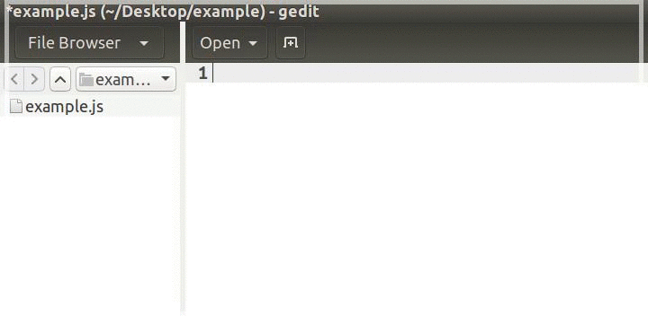

# gedit-javascript-editor
Use gedit as a **javascript editor** :fire: Snippets, highlight syntax and more...  

### Quick steps
  - [Setup preferences](https://github.com/juliomatcom/gedit-javascript-editor#setup-preferences)  
  - [Install plugins](https://github.com/juliomatcom/gedit-javascript-editor#install-plugins)  
  - [Add snippets](https://github.com/juliomatcom/gedit-javascript-editor#add-snippets-for-js)  
  - [Improve javascript laguage for ES6](https://github.com/juliomatcom/gedit-javascript-editor#improve-the-javascript-laguage) *(optional)*

#### Setup preferences  
Go to windows menu bar > **Edit** > **Preferences** and set this options  

- Tab **View**  

- Tab **Editor**  
*Note:* Check **File Saving** is optional

- Tab **Font & Colors**  
  Choose one theme

#### Install plugins
- `$ sudo apt-get install gedit-plugins`  
- Go to **Edit** > **Preferences** > **Plugins** and check the plugins you like

#### Add snippets for js
( js.xml was improved from the original [elson/gedit-javascript-snippet](https://github.com/elson/gedit-javascript-snippets) )
- [**Download**](https://raw.githubusercontent.com/juliomatcom/gedit-javascript-editor/master/js.xml) the snippets file: [js.xml](https://raw.githubusercontent.com/juliomatcom/gedit-javascript-editor/master/js.xml) to your computer
- Go to **Tools** > **Preferences** > **Manage snippets...** and click in **Import Snippets** icon
- Select the **js.xml** downloaded  

#### Improve the javascript laguage
*do this if you use ES6 and want some new keywords highlighted*

-  [**Download**](https://raw.githubusercontent.com/juliomatcom/gedit-javascript-editor/master/javascript.lang) the lang file: [javascript.lang](https://raw.githubusercontent.com/juliomatcom/gedit-javascript-editor/master/javascript.lang) to your computer
- `$ sudo cp path/to/the/javascript.lang /usr/share/gtksourceview-3.0/language-specs/javascript.lang`  
- restart gedit

[MIT](http://licsource.com/mit?name=Julio%20Cesar%20Martin&year=2016&email=juliomatcom@gmail.com&url=http://julces.com/)
