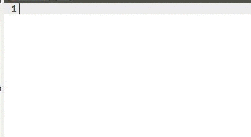

# gedit-javascript-editor
Use gedit as a **javascript editor** :fire: Snippets, highlight syntax and more...  

### Quick steps
1- Setup preferences  
2- Install plugins  
3- Add snippets / autocomplete  
4- Add configuration files  

#### Setup preferences  
Go to windows menu bar > **Edit** > **Preferences** and set this options  

- View  

- Editor  

#### Install plugins
- `$ sudo apt-get install gedit-plugins`  
- Go to **Edit** > **Preferences** > **Plugins** and check the plugins you like

#### Add snippets for js
- Download the snippets file: [js.xml](https://raw.githubusercontent.com/juliomatcom/gedit-javascript-editor/master/js.xml) to your computer
- Go to **Tools** > **Preferences** > **Manage snippets...** and click in **Import Snippets** icon
- Select the **js.xml** downloaded
